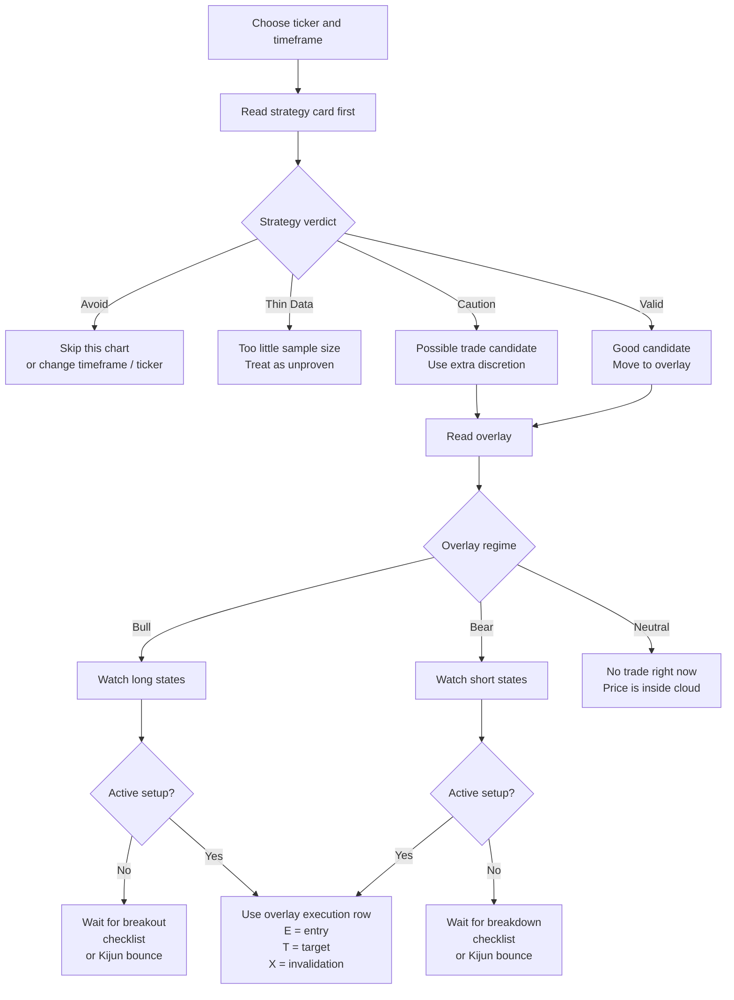

# MMT Ichi Workflow Executive Flowchart

This is the short version of the workflow.

Use it when you want a one-screen view of:

- whether a chart is worth trading
- what the overlay is waiting for
- what each active state actually means

For full implementation detail, see:

- [`Ichi_Workflow_Logic.md`](./Ichi_Workflow_Logic.md)
- [`Ichi_Workflow_Flowchart.md`](./Ichi_Workflow_Flowchart.md)

## Quick Workflow

## What Each Overlay State Means

### Long States

| State | What Must Be True |
| --- | --- |
| `Checklist Long` | Close is above the cloud. Future cloud is bullish with `Span A > Span B`. `Tenkan > Kijun`. Chikou confirmation is bullish, meaning current close is above the displaced candle body and displaced cloud top. `CTF = +4`. `HTF >= +3`. |
| `Kijun Bounce Long` | Bull structure is already present: close above cloud, future cloud bullish, `CTF >= +3`, HTF bullish. Current bar touches or dips through Kijun, then closes back above Kijun. Current bar closes green. Prior close was already above Kijun. |
| `Breakout Long` | Previous close was inside the cloud. Current close is above the cloud top. `CTF >= +2`. HTF bullish. This is earlier and looser than the checklist state. |
| `Edge-to-Edge Long` | Current close enters the cloud from below. HTF is already bullish. This is a cloud-travel setup, not a full bullish checklist state. |

### Short States

| State | What Must Be True |
| --- | --- |
| `Checklist Short` | Close is below the cloud. Future cloud is bearish with `Span A < Span B`. `Tenkan < Kijun`. Chikou confirmation is bearish, meaning current close is below the displaced candle body and displaced cloud bottom. `CTF = -4`. `HTF <= -3`. |
| `Kijun Bounce Short` | Bear structure is already present: close below cloud, future cloud bearish, `CTF <= -3`, HTF bearish. Current bar tags or wicks into Kijun, then closes back below Kijun. Current bar closes red. Prior close was already below Kijun. |
| `Breakout Short` | Previous close was inside the cloud. Current close is below the cloud bottom. `CTF <= -2`. HTF bearish. This is earlier and looser than the checklist state. |
| `Edge-to-Edge Short` | Current close enters the cloud from above. HTF is already bearish. This is a cloud-travel setup, not a full bearish checklist state. |

## What The Overlay Is Waiting For

| Overlay Message | Plain-English Meaning |
| --- | --- |
| `NO TRADE RIGHT NOW` | No active setup is currently being tracked |
| `Wait for bullish cloud alignment` | The chart is not bullish enough yet for a long-only workflow |
| `Wait for bearish cloud alignment` | The chart is not bearish enough yet for a short-only workflow |
| `Watch for breakout, checklist, or kijun bounce` | Regime and HTF are aligned, but the actual trigger bar has not happened yet |
| `Execution: E / T / X` | A setup is active and the overlay is now tracking entry, target, and invalidation |

## What The Strategy Card Is Telling You

| Verdict | Meaning |
| --- | --- |
| `Valid` | The current ticker / timeframe is behaving well enough for this model |
| `Caution` | The model works, but quality is weaker than desired |
| `Thin Data` | Not enough trades yet to trust the readout |
| `Avoid` | The chart does not validate well for this model |

## One Practical Rule

If the `strategy` does not like the chart, the `overlay` should not be trusted aggressively.
