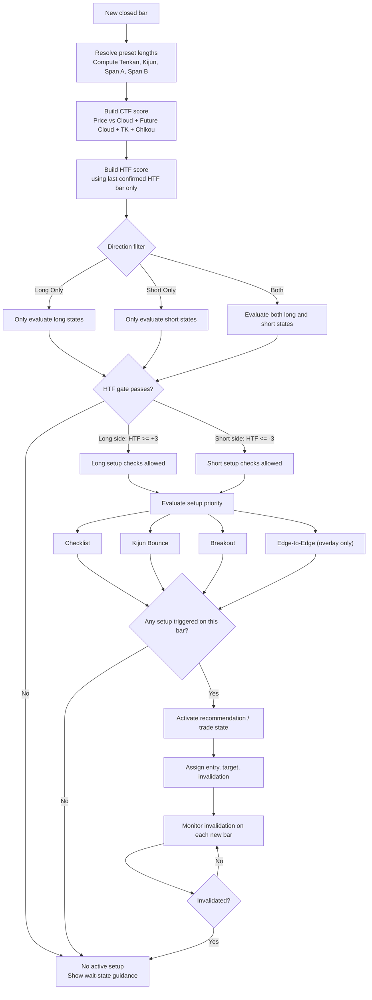
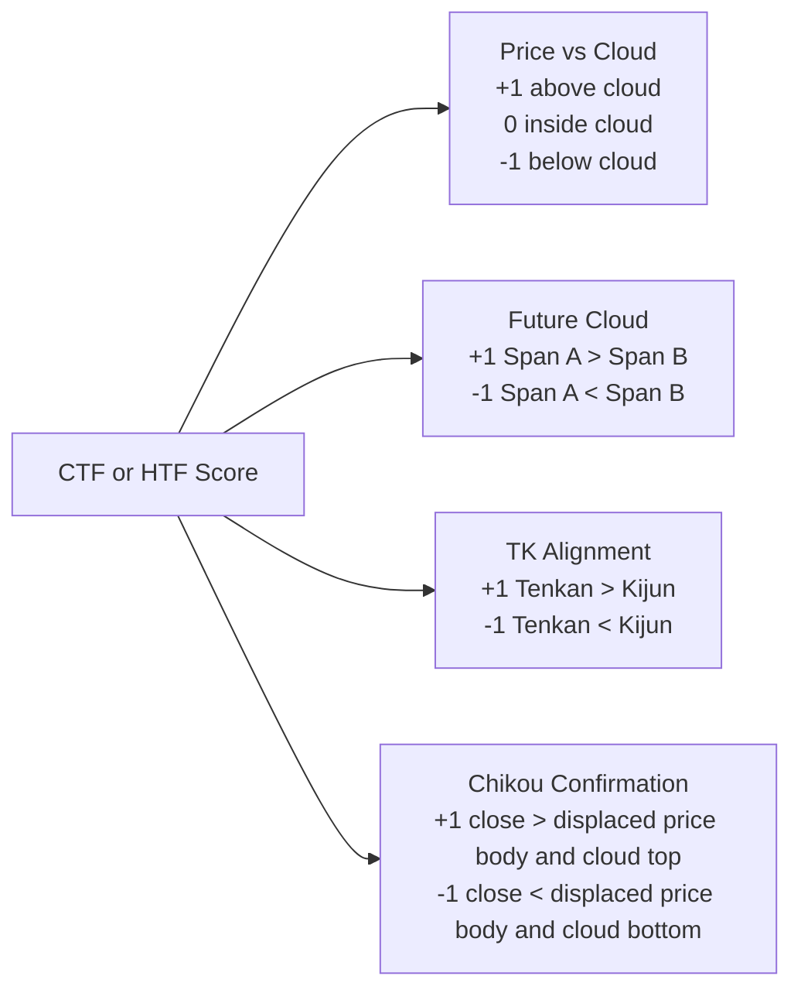
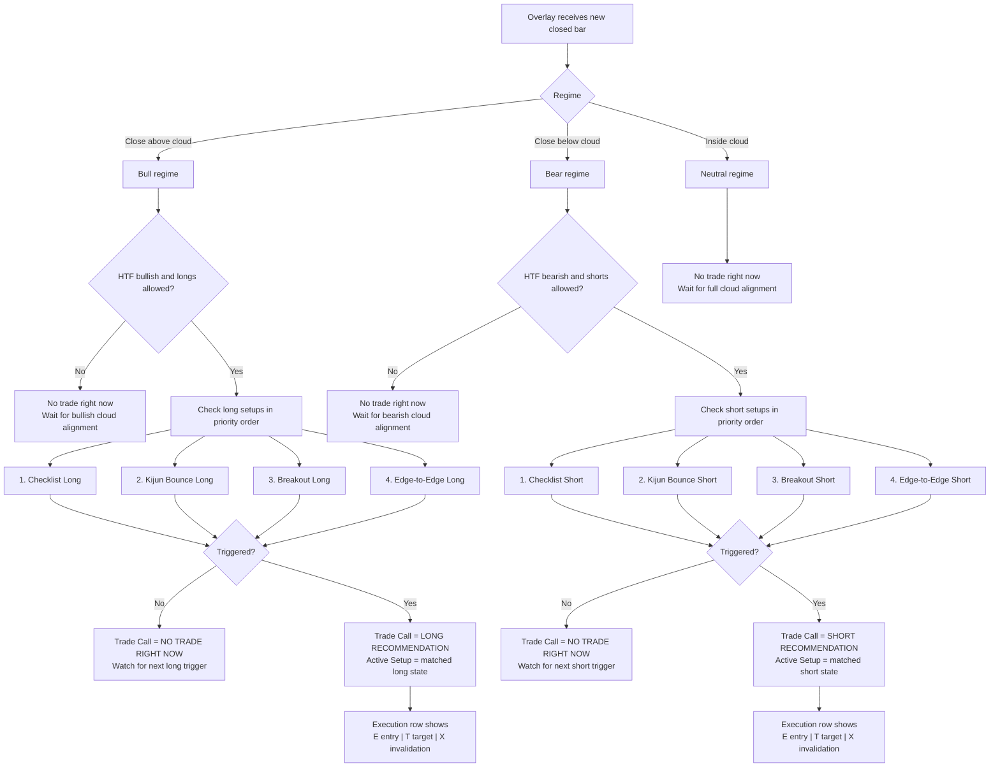
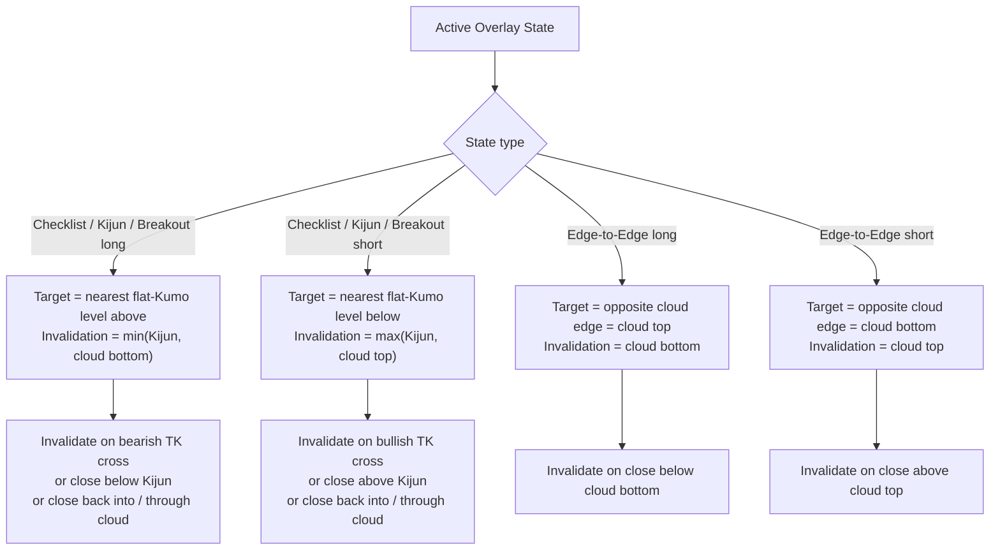
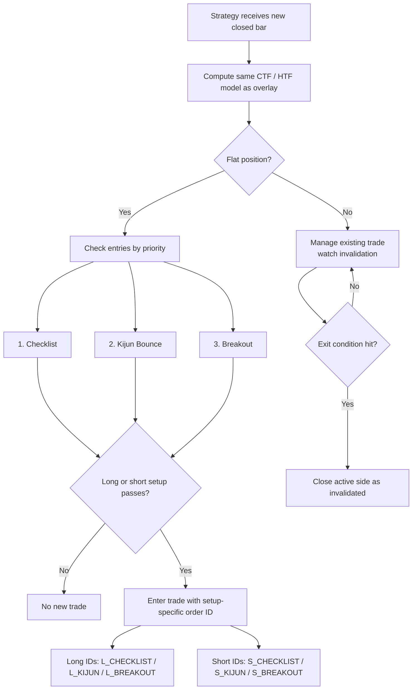
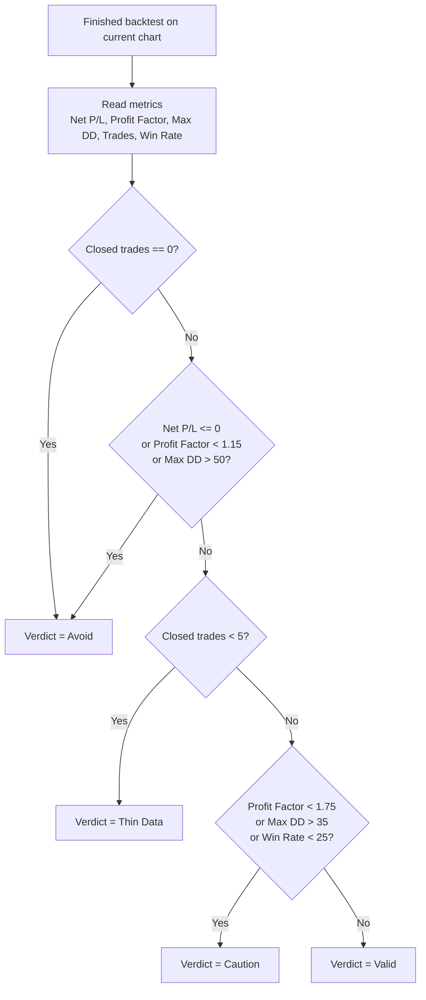
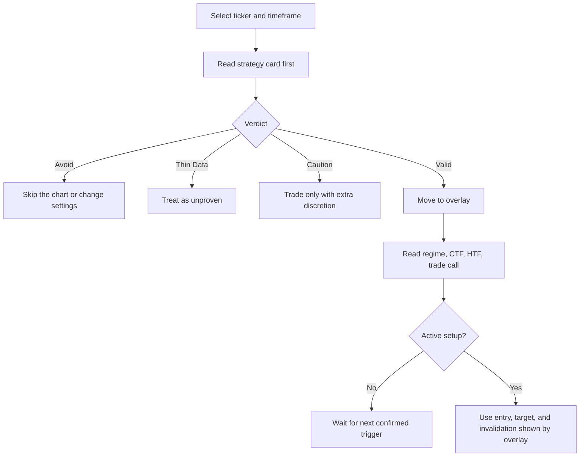

# MMT Ichi Workflow Flowchart

This companion note turns the script logic into a visual decision map.

It is meant to be read alongside:

- [`Ichi_Workflow_Logic.md`](./Ichi_Workflow_Logic.md)
- [`Ichi_Workflow_Metrics.md`](./Ichi_Workflow_Metrics.md)

## Reading Guide

- `CTF` means current timeframe score.
- `HTF` means higher timeframe score.
- `TK` means `Tenkan vs Kijun`.
- `Chikou` confirmation in this model means current close is above or below the displaced candle body and displaced cloud structure.
- All decisions are made on `bar close`.

## 1. Shared Decision Flow

## 2. Shared Score Logic

## 3. Overlay Flow

## 4. Overlay State Notes

### Long States

| Overlay State | Required Subconditions |
| --- | --- |
| `Checklist Long` | `Price vs Cloud = +1`, so close is above the cloud. `Future Cloud = +1`, so Span A is above Span B. `TK = +1`, so Tenkan is above Kijun. `Chikou = +1`, so current close is above the displaced candle body and displaced cloud top. `CTF = +4`. `HTF Score >= +3`. Longs must be allowed by the direction filter. |
| `Kijun Bounce Long` | Bull structure must already be in place: `Price vs Cloud = +1`, `Future Cloud = +1`, and `CTF >= +3`. HTF must be bullish. The current bar must tag or dip through Kijun with `low <= Kijun`, then reclaim it with `close > Kijun`. The bar must close green with `close > open`. The prior bar must already have been above Kijun with `close[1] > Kijun[1]`. |
| `Breakout Long` | The previous bar must have closed inside the cloud. The current bar must close above the cloud top. `CTF >= +2`. HTF must be bullish. Longs must be allowed. This is intentionally looser than the full checklist, so Chikou and TK do not both need to be perfect. |
| `Edge-to-Edge Long` | Price must close into the cloud from below. HTF must already be bullish. Longs must be allowed. This is a cloud-travel state, not a full trend-confirmation checklist state. |

### Short States

| Overlay State | Required Subconditions |
| --- | --- |
| `Checklist Short` | `Price vs Cloud = -1`, so close is below the cloud. `Future Cloud = -1`, so Span A is below Span B. `TK = -1`, so Tenkan is below Kijun. `Chikou = -1`, so current close is below the displaced candle body and displaced cloud bottom. `CTF = -4`. `HTF Score <= -3`. Shorts must be allowed by the direction filter. |
| `Kijun Bounce Short` | Bear structure must already be in place: `Price vs Cloud = -1`, `Future Cloud = -1`, and `CTF <= -3`. HTF must be bearish. The current bar must tag or wick into Kijun with `high >= Kijun`, then reject it with `close < Kijun`. The bar must close red with `close < open`. The prior bar must already have been below Kijun with `close[1] < Kijun[1]`. |
| `Breakout Short` | The previous bar must have closed inside the cloud. The current bar must close below the cloud bottom. `CTF <= -2`. HTF must be bearish. Shorts must be allowed. This is intentionally looser than the full checklist. |
| `Edge-to-Edge Short` | Price must close into the cloud from above. HTF must already be bearish. Shorts must be allowed. This is a cloud-travel state, not a full trend-confirmation checklist state. |

### Overlay Target / Invalidation Notes

## 5. Strategy Flow

## 6. Strategy State Notes

### Entry States

| Strategy State | Required Subconditions |
| --- | --- |
| `Long Checklist Entry` | Same full long checklist as the overlay: close above cloud, future cloud bullish, Tenkan above Kijun, Chikou confirmed above displaced price and cloud, `CTF = +4`, `HTF >= +3`, longs allowed, and no existing position. |
| `Long Kijun Bounce Entry` | Same long bounce logic as the overlay: bullish cloud structure, `CTF >= +3`, HTF bullish, current bar touches Kijun then reclaims it, closes green, previous close already above Kijun, and no existing position. |
| `Long Breakout Entry` | Previous close inside cloud, current close above cloud, `CTF >= +2`, HTF bullish, longs allowed, and no existing position. |
| `Short Checklist Entry` | Same full short checklist as the overlay: close below cloud, future cloud bearish, Tenkan below Kijun, Chikou confirmed below displaced price and cloud, `CTF = -4`, `HTF <= -3`, shorts allowed, and no existing position. |
| `Short Kijun Bounce Entry` | Same short bounce logic as the overlay: bearish cloud structure, `CTF <= -3`, HTF bearish, current bar touches Kijun then rejects it, closes red, previous close already below Kijun, and no existing position. |
| `Short Breakout Entry` | Previous close inside cloud, current close below cloud, `CTF <= -2`, HTF bearish, shorts allowed, and no existing position. |

### Exit States

| Strategy Exit State | Subconditions |
| --- | --- |
| `Exit Long` | Position is long and at least one of these is true: bearish TK cross, close below Kijun, or close back into / through the cloud from above. |
| `Exit Short` | Position is short and at least one of these is true: bullish TK cross, close above Kijun, or close back into / through the cloud from below. |

## 7. Validation Card Flow

## 8. Validation Verdict Notes

| Verdict | Exact Logic | Practical Read |
| --- | --- | --- |
| `Valid` | Not `Avoid`, not `Thin Data`, not `Caution` | Strongest validation state in the strategy |
| `Caution` | At least 5 closed trades, but profit factor, drawdown, or win rate is weaker than desired | Tradable only if you are comfortable with weaker model quality |
| `Thin Data` | Fewer than 5 closed trades, but not bad enough to be `Avoid` | Sample size is too small to trust confidently |
| `Avoid` | No closed trades, non-positive net return, profit factor below `1.15`, or max drawdown above `50%` | Weakest validation state; best to skip or change ticker / timeframe |

## 9. Practical Use

