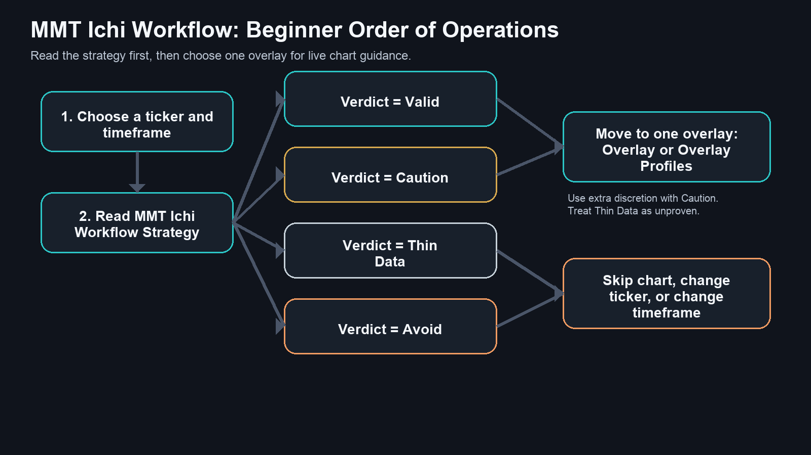
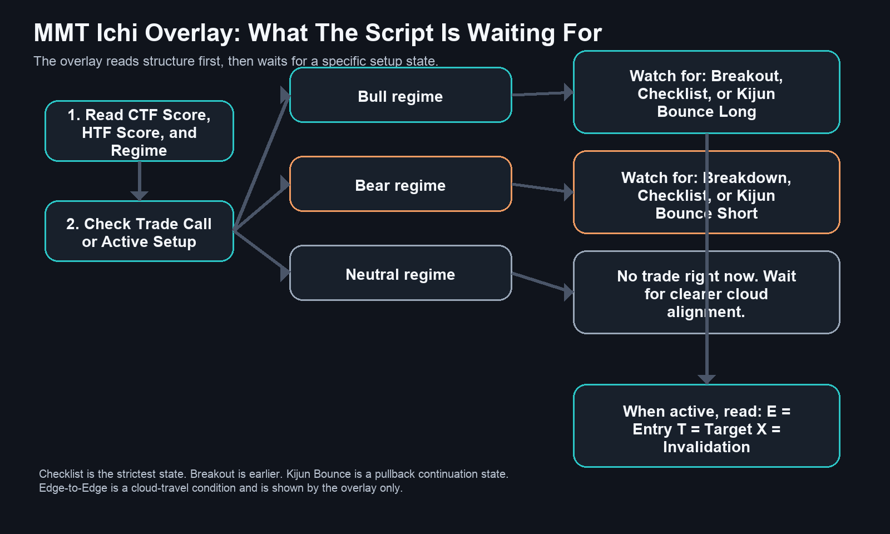

# MMT Ichi TradingView Beginner Guide

## What This Guide Is For

This guide explains how to use the three public `MMT Ichi Workflow` scripts:

- `MMT Ichi Workflow Overlay`
- `MMT Ichi Workflow Overlay Profiles`
- `MMT Ichi Workflow Strategy`

It is written for someone who is new to both trading and TradingView.

The big idea is simple:

- `Strategy` tells you whether a ticker and timeframe are worth trusting.
- `Overlay` tells you what the chart is doing right now.
- `Overlay Profiles` does the same execution job as the normal overlay, but automatically loads ticker-specific defaults when a supported symbol is detected.

## One Important Idea First

These three scripts do not all have the same role.

| Script | Main Job |
| --- | --- |
| `MMT Ichi Workflow Strategy` | Validate the chart with backtest-style metrics. |
| `MMT Ichi Workflow Overlay` | Read the live chart and show execution guidance. |
| `MMT Ichi Workflow Overlay Profiles` | Read the live chart like the normal overlay, but with symbol-specific defaults when a profile exists. |

That means the normal order is:

1. `Strategy` first
2. `Overlay` or `Overlay Profiles` second

Most beginners should use:

- `Strategy`
- plus `one` overlay variant, not both

You can put both overlays on a chart for comparison, but that is not the cleanest way to learn.

## Basic Trading Words

| Term | Simple Meaning |
| --- | --- |
| `Long` | A trade idea that wants price to rise. |
| `Short` | A trade idea that wants price to fall. |
| `Entry` | The price area where the trade idea begins. |
| `Target` | The area where the trade hopes to travel. |
| `Invalidation` | The level that tells you the setup is no longer valid. |
| `Timeframe` | How much time each bar represents, such as `1D` or `1W`. |
| `Backtest` | A test of the strategy rules on past data. |
| `Ichimoku` | A charting framework that uses a cloud, conversion line, base line, and lagging confirmation. |

## How The MMT Ichi Logic Works

The public MMT scripts are built around the same Ichimoku score model.

They score both the current timeframe and the higher timeframe from `-4` to `+4`.

The four score parts are:

| Score Part | Bullish Reading | Bearish Reading |
| --- | --- | --- |
| `Price vs Cloud` | Price is above the cloud | Price is below the cloud |
| `Future Cloud` | Future cloud is bullish | Future cloud is bearish |
| `TK Alignment` | Tenkan is above Kijun | Tenkan is below Kijun |
| `Chikou Confirmation` | The lagging confirmation is bullish | The lagging confirmation is bearish |

That means:

- `+4` = strongest bullish alignment
- `0` = mixed or neutral structure
- `-4` = strongest bearish alignment

The higher timeframe is used as a filter.

- Long setups want a bullish higher timeframe.
- Short setups want a bearish higher timeframe.

## Script 1: MMT Ichi Workflow Strategy

### Purpose

This is the validation layer.

Use it first to decide whether the current ticker and timeframe behave well with the MMT Ichi model. It does not exist to tell you that a trade must be taken right now. It exists to tell you whether the chart has earned your attention.

### Simple Construction

The strategy:

- uses the same Ichimoku scoring model as the overlays
- tests three trade families on the current chart:
  - `Breakout`
  - `Checklist`
  - `Kijun Bounce`
- measures the results using strategy metrics
- gives the chart a simple verdict

### Main Dashboard Fields

| Field | What It Means |
| --- | --- |
| `Chart` | The current symbol and timeframe. |
| `Model` | The active preset, direction filter, and higher timeframe. |
| `Modules` | Which setup families are enabled. |
| `Net P/L` | Net profit or loss over the tested period. |
| `Profit Factor` | Gross profit divided by gross loss. Higher is better. |
| `Max DD` | Maximum drawdown. Lower is safer. |
| `Trades / Win` | Number of closed trades and win rate. |
| `Verdict` | Quick summary: `Valid`, `Caution`, `Thin Data`, or `Avoid`. |

### How To Use The Strategy

Read the strategy card first.

| Verdict | Plain-English Meaning |
| --- | --- |
| `Valid` | This chart behaves well enough to consider trading with the overlay. |
| `Caution` | The chart can work, but the evidence is weaker than you want. |
| `Thin Data` | There are too few trades to trust the result yet. |
| `Avoid` | The chart does not validate well for this model. |

Simple beginner rule:

- if the strategy says `Avoid`, do not trust the overlays aggressively

## Script 2: MMT Ichi Workflow Overlay

### Purpose

This is the standard execution overlay.

Use it after the strategy has told you the chart is worth watching. Its job is to show whether the chart is bullish, bearish, or neutral and whether a live Ichimoku setup is active.

### Simple Construction

The overlay:

- scores the chart on the current timeframe
- scores a higher timeframe for confirmation
- classifies the regime as `Bull`, `Bear`, or `Neutral`
- looks for specific setup families
- draws guidance, targets, and invalidation directly on the chart

### Main Dashboard Fields

| Field | What It Means |
| --- | --- |
| `Chart` | The active symbol and timeframe. |
| `Preset` | The current Ichimoku preset and lengths. |
| `CTF Score` | Current timeframe Ichimoku score from `-4` to `+4`. |
| `HTF Score` | Higher timeframe score from `-4` to `+4`. |
| `Regime` | `Bull`, `Bear`, or `Neutral`. |
| `Trade Call` or `Active Setup` | The current trade state. |
| `Wait For` or `Execution` | Either the next thing the script wants to see, or the active `E / T / X` row. |

### Overlay Setup Families

| Setup | Simple Meaning |
| --- | --- |
| `Checklist` | Full Ichimoku alignment. This is the strictest setup. |
| `Kijun Bounce` | Trend continuation after price retests the Kijun line and holds. |
| `Breakout` | Price exits the cloud with enough alignment to continue. |
| `Edge-to-Edge` | Price enters the cloud and may travel to the opposite side. |

### What The Overlay Messages Mean

| Message | Plain-English Meaning |
| --- | --- |
| `NO TRADE RIGHT NOW` | No active setup is being tracked. |
| `Wait for bullish cloud alignment` | The chart is not bullish enough yet for a long-biased workflow. |
| `Wait for bearish cloud alignment` | The chart is not bearish enough yet for a short-biased workflow. |
| `Watch for breakout, checklist, or kijun bounce` | Structure is aligned, but the trigger bar has not appeared yet. |
| `Execution: E / T / X` | A setup is active, and the overlay is showing entry, target, and invalidation. |

### What The Overlay Draws On The Chart

| Chart Item | What It Means |
| --- | --- |
| cloud shading | The current Ichimoku cloud area |
| regime shading | Bullish, bearish, or neutral background bias |
| marker labels | Setup labels such as breakout or checklist |
| guidance box | The large on-chart trade guidance message |
| `ENTRY` tag | The reference entry area |
| `TARGET` tag | The current target |
| `EXIT / INVALIDATION` tag | The level that would break the setup |
| dotted flat target lines | Nearby flat-Kumo target levels |

## Script 3: MMT Ichi Workflow Overlay Profiles

### Purpose

This is the profile-aware version of the overlay.

Use it when you want the script to load vetted ticker-specific defaults automatically on supported symbols instead of using one generic Ichimoku preset for every chart.

### Simple Construction

The profile overlay does everything the normal overlay does, plus one extra step:

- it checks whether the current ticker has a saved symbol profile
- if yes, it loads the profile label, Ichimoku lengths, and direction default
- if no, it falls back to the manual settings

### Supported Profile Behavior

When a profile is active, the dashboard changes slightly:

- the normal `Preset` row becomes `Profile`
- the value will show the active profile name and cloud lengths

Example supported profile labels in the current script include:

- `BTC Long`
- `ETH Long`
- `SOL Long`
- `GLD Long`
- `SPY Long`
- `DBC Long`
- `LQD Short`
- `KRE Long`

If no profile exists for the ticker, the script falls back to `Manual`.

### When To Use Overlay Profiles Instead Of The Normal Overlay

Use `Overlay Profiles` when:

- the ticker is one of the covered symbols
- you want the script to choose the tuned defaults for you

Use the normal `Overlay` when:

- you want full manual control
- you are comparing presets yourself
- the ticker is not one of the profiled symbols

## How To Use The Three Scripts Together

The intended workflow is:

1. Choose a ticker and timeframe.
2. Read the `Strategy` card first.
3. If the verdict is acceptable, move to an overlay.
4. Use:
   - `Overlay` for the standard model
   - or `Overlay Profiles` for the auto-profile model
5. Wait for the overlay to move from `no trade` to an active setup.

### Beginner Workflow

| Step | What To Do | What You Are Looking For |
| --- | --- | --- |
| `1` | Open a chart | Start on `1D` for simplicity. |
| `2` | Add `MMT Ichi Workflow Strategy` | Read the validation card first. |
| `3` | Check `Verdict` | Prefer `Valid`. Be careful with `Caution` or `Thin Data`. Avoid `Avoid`. |
| `4` | Add one overlay | Use standard `Overlay` or `Overlay Profiles`. |
| `5` | Read `CTF Score`, `HTF Score`, and `Regime` | This tells you if the chart is aligned. |
| `6` | Read `Trade Call` / `Active Setup` and `Wait For` / `Execution` | This tells you whether the chart is ready now or still waiting. |
| `7` | If active, read `E`, `T`, and `X` | These are the live trade guidance levels. |

## What The Chart Syntax Means

### In The Strategy Card

- `Valid`
  - best case: the chart has acceptable historical behavior with the model
- `Caution`
  - the chart can work, but quality is weaker
- `Thin Data`
  - the sample is too small to trust
- `Avoid`
  - the chart is not validating well

### In The Overlay Dashboard

- `CTF Score`
  - current timeframe score
- `HTF Score`
  - higher timeframe score
- `Regime`
  - `Bull`, `Bear`, or `Neutral`
- `Trade Call`
  - what the script thinks you should do now
- `Wait For`
  - the next condition the script is waiting for
- `Execution`
  - a compact row showing:
    - `E` = entry
    - `T` = target
    - `X` = invalidation

### In The Profile Overlay Dashboard

- `Profile`
  - the active symbol profile, if one exists
- `Manual`
  - no profile is active, so the script is using manual settings

## Recommended Defaults For Beginners

### Strategy

- keep the default preset first
- keep the default higher timeframe first
- leave all three modules enabled

### Overlay

- use one overlay at a time
- keep the default preset first
- keep `Long Only` if you are new and reviewing bullish markets

### Overlay Profiles

- turn `Use Symbol Profiles` on
- verify that the `Profile` row matches the ticker you expected

## Common Beginner Mistakes

| Mistake | Better Approach |
| --- | --- |
| Using the overlay before checking the strategy | Read the strategy card first. |
| Treating `Thin Data` as a strong green light | Thin data means the sample is too small. |
| Using both overlays at once on day one | Start with one overlay so the chart stays readable. |
| Ignoring the higher timeframe | The workflow depends on higher-timeframe confirmation. |
| Confusing `Breakout` with `Checklist` | Checklist is stricter and stronger than a breakout. |
| Assuming `Edge-to-Edge` is the same as a normal breakout | It is a cloud-travel state, not the same setup family. |

## Two Simple Flowcharts

### Flowchart 1: Strategy First, Overlay Second

### Flowchart 2: Overlay Decision Logic

## Short Version To Remember

- `Strategy` answers: `Is this chart worth trading?`
- `Overlay` answers: `What is the chart doing right now?`
- `Overlay Profiles` answers the same question, but with ticker-specific defaults when available

## Final Reminder

The clean beginner workflow is:

1. `Strategy` first
2. then `Overlay` or `Overlay Profiles`
3. trust the overlay more when the strategy already likes the chart
